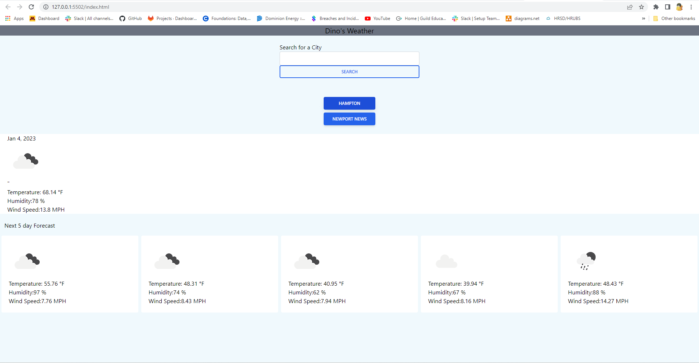

# Weather Dashboard
Welcome to my weather Website, this website is set up to show you the current weather of any city in the USA. Just type in a city and watch as it shows you the predicted weather for the next 5 days.

## Requirements
A connection to the internet and a chrome web browser will give you access to this webpage. Just go to #
by typing it into the URL of your web browser and you will be able to go to this webpage.

You can also click on the link below and it will send you to the weather dashboard
[Dino's Weather](https://marcosauras.github.io/weather-channel/)

## Usage

This website will be of interest to anyone wanting to know what the next few days weather is going to be, to either help plan outfits or an outing. after going to the webpage you will see a search bar, just enter your address and hit search, the webpage will then show you the current day plus 5 days in the future of the weather

if you are interested in searching other locations just type in the location of the new city in the search bar and the info will be displayed, as you search buttons will start to be displayed formed from your searches just click on one of them if you would like to go back a page.

## Credits
Marc Hamilton

## License

Please refer to the license in the github repo.
